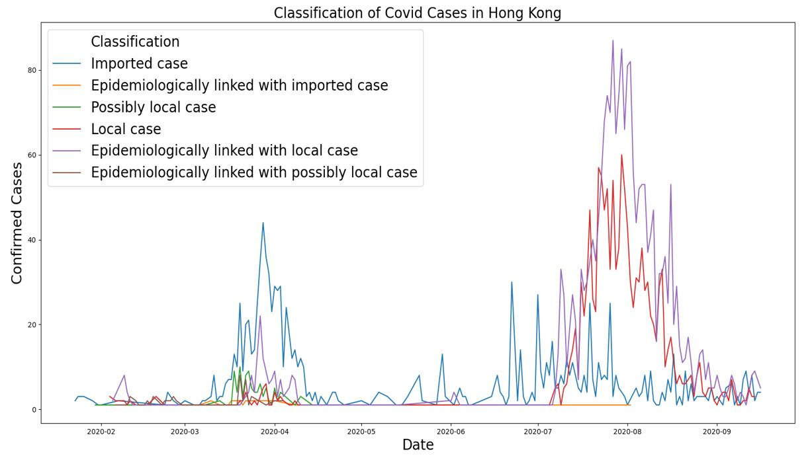
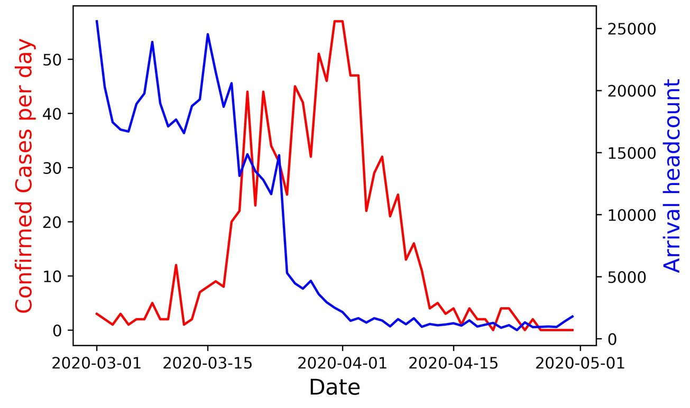
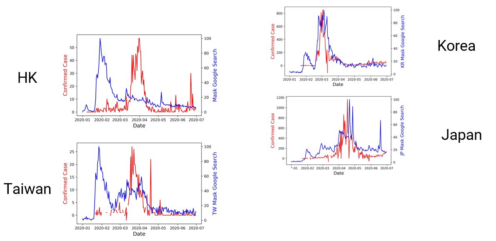
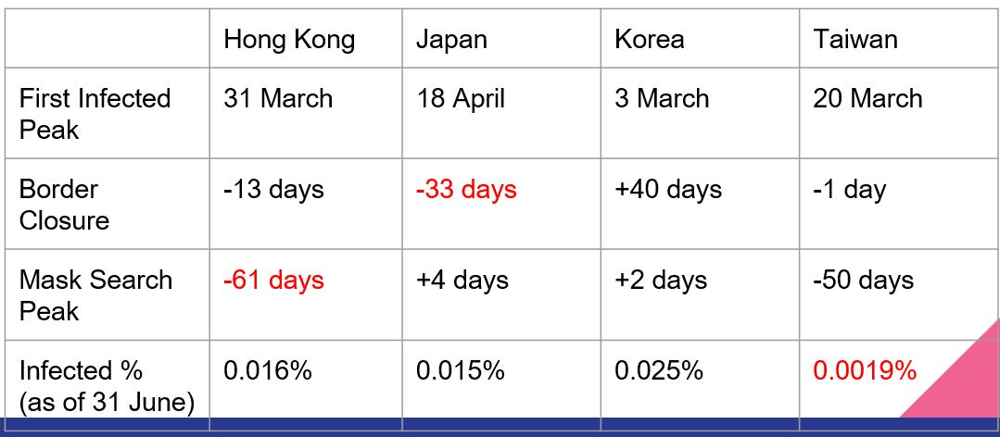

# COVID19 Response From HK
## A Web Scraping and Data Analysis Project
 
-----------------------------------------

## Overview
- COVID19 is turning around the world socially and economically
- A lot of covid-related data is available online for further analysis
- We can gain insight from past experience to handle pandemics more effectively

## Data Collection and Preprocessing
1. <a href="https://data.gov.hk/en-data/dataset/hk-dh-chpsebcddr-novel-infectious-agent">Hong Kong Government COVID-19 Database</a>
2. <a href="https://pypi.org/project/pytrends/">Pytrends - API for extracting Google Trends</a>
3. <a href="https://www.news.gov.hk/chi/index.html">Press Release from Hong Kong Government</a>
4. <a href="https://www.immd.gov.hk/eng/message_from_us/stat.html">Web Scraping on Immigration Department</a>

## Findings
#### Number of COVID Cases in Hong Kong
- Two peaks are observed in the graph, only the first peak would be investigated in this project
- The first peak was around end of March 2020, with cases mainly identified as imported cases

#### Relationship between COVID cases and arrival count
- On 25 Mar 2020, HKSAR government imposed a no-entry measure for all non-HK residents from overseas
- This explaines the abrupt drop of arrival count indicated by the blue line
- COVID cases count peaked in around a week later, indicated by the red line, then dropped to nearly none by May
- Taking the incubation period of COVID into account, it could be inferred that border closure is effective to cut down cases

#### Relationship between COVID cases and Google Trend on "mask"
- Data of 4 regions, inlcuding Hong Kong, are analyzed
- The peak of both cases and search frequency overlap in Japan and Korea
- Search frequency peaked 2 months earlier than covid cases in HK and Taiwan
- Higher awareness on precautious measures are seen for people in HK and Taiwan

## Conclusion
- Individual awareness of Hong Kong people is relatively high to prepare for COVID
- Early border clousure cut down the number of imported cases and hence prevent arise of local cases

